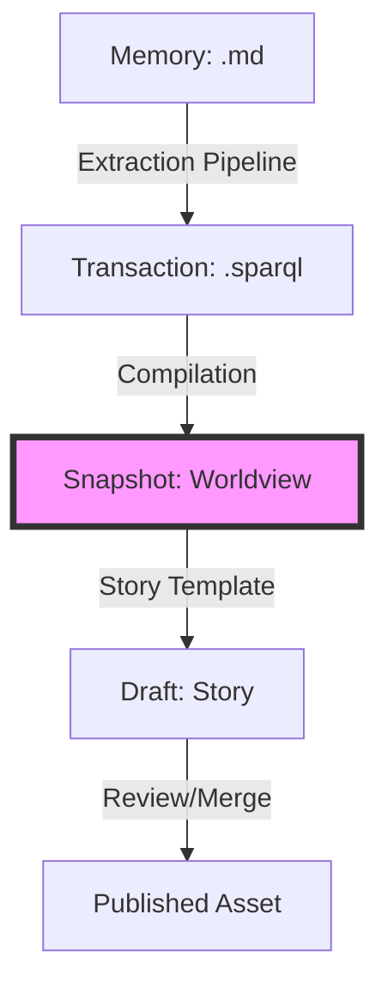

### State

The collective memory for this repository is currently in an **initialization state**. While the structural framework (ontology, workflows, and story templates) is fully deployed, the **compiled worldview is empty**. 

- **Identity**: Unpopulated.
- **Domains**: 0 of 7 domains (Opportunity, Strategy, Product, Architecture, Organization, Proof, Style) contain substantive claims.
- **Ontology**: The `narr:` namespace is active, defining a rich hierarchy for Narrative Architecture, including conviction levels (Notion to Principle) and cross-domain relationships.

As per the `ASWRITTEN.md` protocol, the system is currently in **Onboarding Mode**. The focus is on seeding the first memories to establish an organizational identity.

---

### Stories

The repository contains several "Stories"—templates that transform the raw knowledge graph into human-readable narratives.

| Story | Intent | Relationship to Whole | Approach |
| :--- | :--- | :--- | :--- |
| **North Star** | Synthesize immediate strategic priorities. | The "Compass." Used at the start of every session to ground AI behavior. | Queries the snapshot for active bets, deadlines, and "Focus Locks." |
| **Summary** | Provide a high-level overview of the worldview. | The "Map." A scannable state-of-the-union for the entire graph. | Compiles all domains into a single document for reviewers. |
| **Changelog** | Narrate organizational shifts for external audiences. | The "History." Tracks how decisions evolve over time. | Triggered by new transactions; explains *why* a shift matters. |
| **Graph Health** | Analyze the structural integrity of the memory. | The "Diagnostics." Identifies orphans, dead ends, and sparse clusters. | Uses graph topology metrics (centrality, density) to suggest improvements. |
| **Marketing Cheatsheet** | Generate consistent messaging and pitches. | The "Voice." Ensures external communication matches internal strategy. | Extracts positioning, terminology, and value props for specific personas. |

---

### Assets

The repository is structured to support a git-native extraction pipeline:

- **`.aswritten/memories/`**: The primary source of truth. Contains `.md` files (transcripts, decision logs) written by humans.
- **`.aswritten/tx/`**: The "Transaction Log." Contains auto-generated `.sparql` files that map memory content into the RDF graph.
- **`.aswritten/stories/`**: Story templates (like the ones above) that define how to render the graph into documents.
- **`.aswritten/drafts/`**: Temporary staging area for generated stories before they are published.
- **`ASWRITTEN.md` & `CLAUDE.md`**: The operational protocols. They define how AI agents must interact with the memory (citations, conviction levels, onboarding).
- **`ontology.ttl` (via tool)**: The formal schema defining the relationships between Narrative, Strategy, Product, and Architecture.

---

### Transactions

*No transactions have been recorded yet.*

The graph is currently a "blank slate." The next step in the lifecycle is to ingest the first memory (e.g., a project README or a founder interview) to trigger the first transaction.

**Significance**: The absence of transactions indicates that while the "brain" (ontology) and "limbs" (workflows) are ready, the "memory" (data) has not yet been initialized. Onboarding is required to populate the `Identity` and `Strategy` domains.