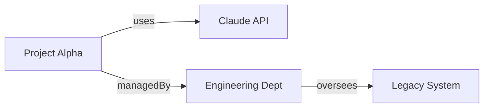

To provide a transaction summary, I first need to identify the specific transaction (`.sparql` file) and its corresponding memory file. 

Currently, the repository appears to be in an initial state (only a `.gitkeep` was found in the memories directory). Please **provide the content of the `.sparql` transaction** you would like me to summarize, or ensure the transaction has been committed to the repository so I can retrieve it.

Once provided, I will generate the summary following this structure:

1.  **Transaction Overview**: Source, Contributor, Date, and Domain.
2.  **Knowledge Added**: New entities and relationships.
3.  **Connections**: How it bridges existing gaps in the graph.
4.  **Worldview Impact**: What this enables for the organization.

**Example of what I can produce once the data is available:**

```markdown
# Transaction: 2023-10-27-project-alpha.sparql

**Source:** memories/2023-10-27-project-alpha.md
**Contributor:** @jdoe
**Date:** 2023-10-27
**Domain:** Project Management / AI Integration

## Knowledge Added
- **Entity:** `ProjectAlpha` (Internal Initiative)
- **Relationship:** `ProjectAlpha` -> `uses` -> `ClaudeAPI`
- **Attribute:** `ProjectAlpha` status set to `In-Progress`

## Connections


## Worldview Impact
This transaction formalizes the link between our engineering department and specific AI tooling. We can now track which legacy systems are being augmented by Project Alpha, enabling better resource allocation for AI transitions.
```