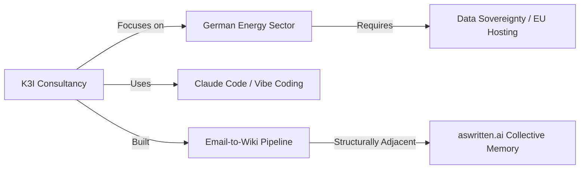

# Transaction: 2026-03-05-k3i-call-martin-klepsch.md

**Source:** `.aswritten/memories/2026-03-05-k3i-call-martin-klepsch.md`  
**Contributor:** n8n.aswritten.ai (Extraction from Scarlet Dame / Martin Klepsch call)  
**Date:** 2026-03-05  
**Domain:** AI Consultancy / Knowledge Infrastructure

## Knowledge Added

- **New Entities:** 
    - **K3I**: An AI consultancy targeting the German energy sector (grid operators/municipalities).
    - **Martin Klepsch**: Co-founder of K3I, Clojure community veteran, and heavy Claude Code user.
- **Key Concepts:**
    - **AI Re-enchantment**: The visceral "magic" felt by veteran engineers using AI, contrasted with non-engineers who accept it as a baseline.
    - **Vibe Coding**: Rapid, AI-assisted prototyping (e.g., K3I's non-technical co-founder building a functional file-sharing app).
    - **Internal Champion Strategy**: A sales tactic for conservative industries focusing on outcome-specific framing and internal advocates.
- **Technical Workflows:**
    - **Email-to-Wiki Pipeline**: Extraction of 100k emails into structured wiki pages to power agentic workflows.
    - **Monorepo "Harness"**: A system of templates and skills (one new skill/day) for rapid business automation.

## Connections

- **Structural Adjacency:** K3I’s "Email → Wiki → Agent" pipeline mirrors `aswritten.ai`’s core mission of turning unstructured communication into structured collective memory.
- **Market Validation:** Confirms that conservative sectors (Energy) require "stability-first" framing and EU-hosted data sovereignty.

## Worldview Impact

This transaction reinforces the **"Starting Fresh Advantage"**: new, AI-native organizations can operate with 80% less legacy friction by "engineering the business" itself through automated skills. It validates that the "magic" of AI is most effectively harnessed by those who understand the "before-times" of manual engineering but are willing to "vibe code" the future. For `aswritten.ai`, K3I represents a peer-signal that structured knowledge extraction is becoming the foundational infrastructure for the next generation of firms.